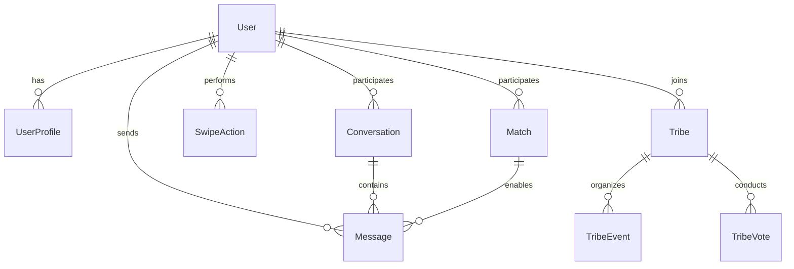

# Pendo Mobile Data Models

## 1. Authentication Models

### UserModel
```dart
class UserModel {
  int id;
  String? email;
  String? phone;
  bool isActive;
  bool isVerified;
  bool isPremium;
  DateTime createdAt;
  DateTime updatedAt;
  UserProfileModel profile;
}

class UserProfileModel {
  int id;
  int userId;
  String name;
  int age;
  String? bio;
  double? latitude;
  double? longitude;
  List<String> photos;
  List<String> interests;
  Map<String, dynamic>? extraData;
  int pendoScore;
  String? currentTribeId;
  DateTime createdAt;
  DateTime updatedAt;
}
```

### AuthModel
```dart
class AuthResponseModel {
  String accessToken;
  String refreshToken;
  UserModel user;
  DateTime expiresAt;
}

class LoginRequestModel {
  String? email;
  String? phone;
  String password;
}

class RegisterRequestModel {
  String? email;
  String? phone;
  String password;
  String name;
  int age;
  String? bio;
  List<String> interests;
}
```

## 2. Matching Models

### MatchModel
```dart
class MatchModel {
  String id;
  UserModel user;
  bool isSuperLike;
  DateTime createdAt;
  bool isRead;
  String? lastMessage;
  DateTime? lastMessageAt;
}

class SwipeActionModel {
  String userId;
  String action; // like, pass, superLike
  DateTime timestamp;
}
```

## 3. Chat Models

### MessageModel
```dart
class MessageModel {
  String id;
  String conversationId;
  String senderId;
  String content;
  String type; // text, image, etc.
  DateTime timestamp;
  bool isRead;
  Map<String, dynamic>? metadata;
}

class ConversationModel {
  String id;
  List<String> participantIds;
  String? lastMessageContent;
  DateTime? lastMessageTime;
  bool isGroup;
  String? groupName;
  String? groupAvatar;
  Map<String, int> unreadCount;
}

class IcebreakerModel {
  String id;
  String question;
  String category;
  Map<String, String> translations;
  bool isActive;
}
```

## 4. Tribe Models

### TribeModel
```dart
class TribeModel {
  String id;
  String name;
  String description;
  String avatar;
  String coverImage;
  String status; // active, pending, archived
  UserModel chief;
  List<UserModel> moderators;
  List<UserModel> members;
  Map<String, dynamic> settings;
  DateTime createdAt;
  DateTime updatedAt;
}

class TribeEventModel {
  String id;
  String tribeId;
  String title;
  String description;
  DateTime startTime;
  DateTime endTime;
  String location;
  double? latitude;
  double? longitude;
  List<UserModel> attendees;
  Map<String, dynamic>? metadata;
}

class TribeVoteModel {
  String id;
  String tribeId;
  String title;
  String description;
  DateTime startTime;
  DateTime endTime;
  List<String> options;
  Map<String, List<String>> votes; // option -> [userId]
  bool isActive;
}
```

## 5. Relationships



## 6. Data Flow

### Authentication Flow
1. User registers/logs in
2. Server validates credentials
3. Returns JWT tokens and user data
4. Client stores tokens securely
5. Uses tokens for subsequent requests

### Matching Flow
1. User views potential matches
2. Performs swipe action
3. If mutual match, creates Match
4. Enables chat between users
5. Updates match statistics

### Chat Flow
1. User opens conversation
2. Loads message history
3. Real-time updates via WebSocket
4. Handles message delivery/read status
5. Supports media messages

### Tribe Flow
1. User creates/joins tribe
2. Participates in tribe activities
3. Can create events/votes
4. Real-time tribe chat
5. Role-based permissions

## 7. Security Considerations

### Data Protection
- Sensitive data encryption
- Secure token storage
- API request signing
- Certificate pinning

### Privacy
- User data visibility control
- Location data protection
- Message encryption
- Report/block functionality

### Validation
- Input sanitization
- Request rate limiting
- File upload restrictions
- User verification

## 8. Performance Optimization

### Caching Strategy
- User profile caching
- Message history caching
- Image caching
- Tribe data caching

### Data Sync
- Background sync
- Incremental updates
- Conflict resolution
- Offline support

### Memory Management
- Image size optimization
- Message pagination
- Resource cleanup
- Memory monitoring
